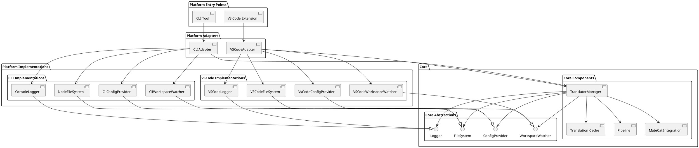
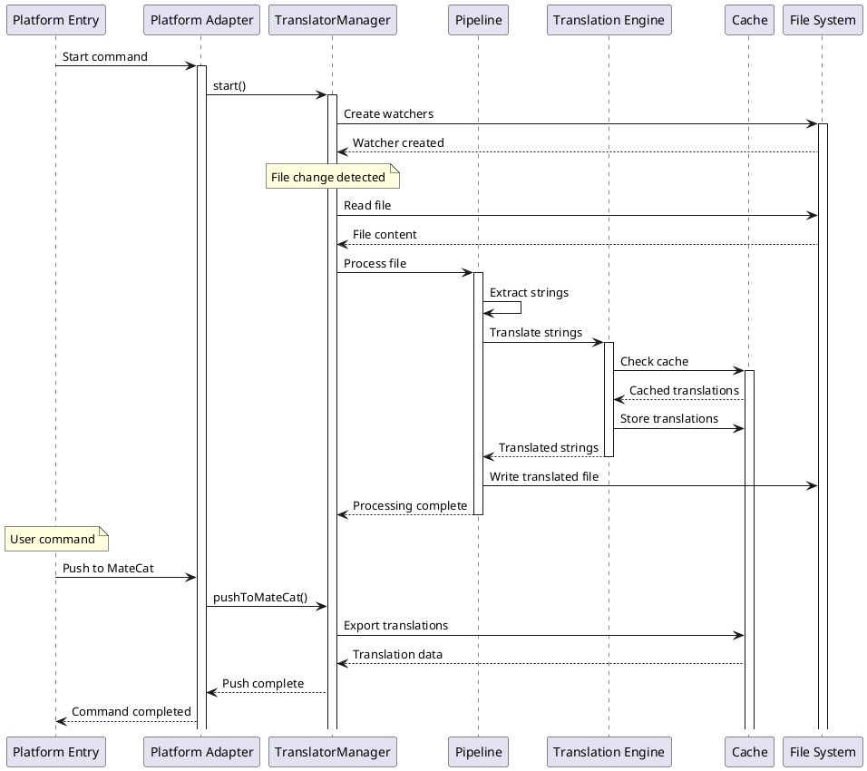
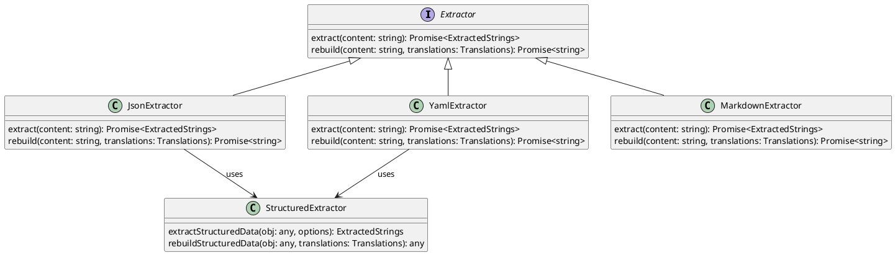
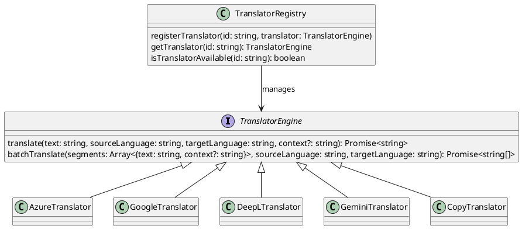

# I18n Translator Architecture

## Overview

The I18n Translator is built with a platform-agnostic core architecture that can be shared between the VSCode extension and CLI tools. This document describes the architectural design, key components, and how they interact.

## Core Architectural Principles

1. **Platform Independence**: Core functionality is separated from platform-specific code
2. **Dependency Injection**: Components depend on abstractions, not concrete implementations
3. **Single Responsibility**: Each component has a clearly defined purpose
4. **Interface-Based Design**: Well-defined interfaces enable multiple implementations
5. **Separation of Concerns**: Platform-specific code is isolated from core business logic

## Architecture Diagram



## Core Design Principles

1. **Platform Agnosticism**: Core components are designed to be independent of the platform they run on.
2. **Interface-Driven Design**: Abstract interfaces define behaviour, with platform-specific implementations.
3. **Dependency Injection**: Platform-specific implementations are injected into core components.
4. **Clear Boundaries**: Clear separation between core functionality and platform-specific code.

## High-Level Architecture Overview

The project is organized into three main layers:

1. **Core Layer**: Platform-agnostic business logic and abstractions
2. **Platform Layer**: Implementations for specific platforms (VSCode, CLI)
3. **Integration Layer**: Entry points that connect platforms to the core

## Core Layer

The core layer contains all platform-independent functionality and abstractions.

### Key Abstractions

#### FileSystem (`src/core/util/fs.ts`)
Provides platform-agnostic file operations:

```typescript
export interface URI {
  /**
   * The file system path
   */
  fsPath: string

  /**
   * The scheme (e.g., 'file', 'untitled')
   */
  scheme: string

  /**
   * File path with appropriate separators for the platform
   */
  path: string
}

export interface FileSystem {
  /**
   * Read file content as string
   */
  readFile(uri: URI): Promise<string>

  /**
   * Write string content to a file
   */
  writeFile(uri: URI, content: string): Promise<void>

  /**
   * Delete a file
   */
  deleteFile(uri: URI, options?: { recursive?: boolean; useTrash?: boolean }): Promise<void>

  /**
   * Check if a file exists
   */
  fileExists(uri: URI): Promise<boolean>

  /**
   * Create a directory and any parent directories that don't exist
   */
  createDirectory(uri: URI): Promise<void>

  /**
   * Read directory contents
   */
  readDirectory(uri: URI): Promise<Array<{ name: string; isDirectory: boolean }>>

  /**
   * Create a URI object from a file path
   */
  createUri(fsPath: string): URI

  /**
   * Join a URI with a path segment
   */
  joinPath(uri: URI, ...pathSegments: string[]): URI
}
```

#### Logger (`src/core/util/logger.ts`)
Provides platform-agnostic logging:

```typescript
export enum LogLevel {
  Debug = 0,
  Info = 1,
  Warn = 2,
  Error = 3
}

export interface Logger {
  setLevel(level: LogLevel): void;
  info(message: string): void;
  warn(message: string): void;
  error(message: string): void;
  debug(message: string): void;
}
```

#### Watcher (`src/core/util/watcher.ts`)
Provides platform-agnostic file watching:
- `FileWatcher`: Interface for watching file changes
- `WorkspaceWatcher`: Interface for watching workspace-level changes
- `Disposable`: Interface for cleanup operations

#### ConfigProvider (`src/core/config.ts`)
Provides platform-agnostic configuration access:

```typescript
export interface ConfigProvider {
  get<T>(section: string, defaultValue?: T): T;
  update(section: string, value: any): Promise<void>;
}
```

### Core Components

#### TranslatorManager (`src/core/translatorManager.ts`)
Central orchestrator for all translation operations:
- Manages the lifecycle of translation activities
- Coordinates file watching, processing, and MateCat integration
- Works with abstractions rather than concrete implementations

```typescript
export class TranslatorManager {
  constructor(
    fileSystem: FileSystem,
    logger: Logger,
    cache: TranslationCache,
    configProvider: ConfigProvider
  ) { /* ... */ }

  // Core operations
  async start(): Promise<void> { /* ... */ }
  async stop(): Promise<void> { /* ... */ }
  async processFile(uri: URI): Promise<void> { /* ... */ }
}
```

#### Translation Pipeline (`src/core/pipeline.ts`)
The translation pipeline processes files through these steps:
1. Detect file type based on extension
2. Extract translatable strings using the appropriate extractor
3. Determine which translation engine to use based on configuration
4. Translate strings using the selected engine
5. Rebuild the file with translated strings
6. Write the output to the target language directories

#### Translation Cache (`src/core/cache/sqlite.ts`)
Manages the translation cache:
- Stores previously translated segments
- Optimizes translation speed and reduces API calls
- Handles import/export of translation memory

## Platform-Specific Implementations

### VSCode Extension (`src/vscode/`)

#### VSCodeAdapter (`src/vscode/adapter.ts`)
- Acts as the bridge between VSCode extension API and core
- Handles VSCode-specific lifecycle events
- Manages status bar items and output channel
- Registers VSCode commands

```typescript
export class VSCodeAdapter {
  constructor(context: vscode.ExtensionContext) { /* ... */ }

  async activate(): Promise<void> { /* ... */ }
  deactivate(): void { /* ... */ }

  async startTranslator(): Promise<void> { /* ... */ }
  async stopTranslator(): Promise<void> { /* ... */ }
}
```

#### VSCodeFileSystem (`src/vscode/filesystem.ts`)
- Implements `FileSystem` using VSCode's workspace APIs
- Wraps VSCode's `Uri` objects with our `URI` interface

#### VSCodeLogger (`src/vscode/logger.ts`)
- Implements `Logger` using VSCode's output channel
- Provides visibility within the VSCode UI

#### VSCodeWorkspaceWatcher (`src/vscode/watcher.ts`)
- Implements file watching using VSCode's `FileSystemWatcher`
- Translates VSCode events to our abstraction

#### VsCodeConfigProvider (`src/vscode/config.ts`)
- Implements configuration access using VSCode's settings API
- Handles workspace and user-level settings

### CLI Implementation (`src/cli/`)

#### CLITranslatorAdapter (`src/cli/adapter.ts`)
- Bridge between CLI and core functionality
- Manages lifecycle and CLI-specific operations

#### CliCommands (`src/cli/commands.ts`)
- Implements the command-line interface using Commander.js
- Provides commands for `start`, `push`, `pull` operations
- Handles CLI-specific argument parsing

```typescript
export class CliCommands {
  constructor() { /* ... */ }

  async run(argv: string[] = process.argv): Promise<void> { /* ... */ }

  private async startCommand(options: any): Promise<void> { /* ... */ }
  private async pushCommand(options: any): Promise<void> { /* ... */ }
  private async pullCommand(options: any): Promise<void> { /* ... */ }
}
```

#### NodeFileSystem (`src/core/util/fs.ts`)
- Node.js implementation of FileSystem interface
- Uses Node.js fs/promises API

#### ConsoleLogger (`src/core/util/logger.ts`)
- Console implementation of Logger interface
- Uses standard console for output

#### CLIWorkspaceWatcher (`src/cli/watcher.ts`)
- CLI implementation of WorkspaceWatcher interface
- Uses file system watcher library for file watching

```typescript
export class CLIWorkspaceWatcher implements WorkspaceWatcher {
  constructor(
    private fs: FileSystem,
    private logger: Logger,
    private workspacePath: string
  ) { /* ... */ }

  createFileSystemWatcher(pattern: string): FileWatcher { /* ... */ }
  dispose(): void { /* ... */ }
}
```

#### CLIConfigProvider (`src/cli/config.ts`)
- CLI implementation of ConfigProvider interface
- Uses JSON file for configuration storage

## Integration Points and Data Flow

### Entry Points

#### VSCode Extension Entry (`src/extension.ts`)
- Exports `activate` and `deactivate` functions required by VSCode
- Initializes the VSCodeAdapter and delegates functionality to it

```typescript
export async function activate(context: vscode.ExtensionContext) {
  outputChannel = vscode.window.createOutputChannel('i18n Translator');

  const vsCodeAdapter = new VSCodeAdapter(context);
  await vsCodeAdapter.activate();

  // Register commands
  context.subscriptions.push(
    vscode.commands.registerCommand('translator.start', () => vsCodeAdapter.startTranslator()),
    vscode.commands.registerCommand('translator.stop', () => vsCodeAdapter.stopTranslator()),
    // ... additional commands
  );
}

export function deactivate() {
  // Clean up resources
}
```

#### CLI Entry Point (`src/cli/index.ts`)
- Provides the main entry point for the CLI executable
- Initializes the CLI commands and starts execution

```typescript
#!/usr/bin/env node
import { CliCommands } from './commands';

async function main(): Promise<void> {
  try {
    const cli = new CliCommands();
    await cli.run();
  } catch (error) {
    console.error('Error:', error);
    process.exit(1);
  }
}

main();
```

### Data Flow



1. **File Change Detection**
   - Platform-specific watcher detects file changes
   - Events are normalized and passed to TranslatorManager
   - TranslatorManager orchestrates processing

2. **Configuration Loading**
   - Platform-specific ConfigProvider loads configuration
   - TranslatorManager applies configuration to the process

3. **Translation Process**
   - TranslatorManager triggers pipeline processing
   - Pipeline extracts content using appropriate extractor
   - Content is translated and stored in cache
   - Output files are generated in target language directories

4. **MateCat Integration**
   - TranslatorManager provides methods for MateCat operations
   - Push/pull operations interact with the cache

## Extractors

The extension supports extracting translatable strings from different file formats:



### Structured Data Extractor

The `structured.ts` module provides a shared implementation for extracting strings from structured data formats like JSON and YAML. Both formats are represented as JavaScript objects after parsing, and they share the same traversal and rebuilding logic.

Key components:
- `extractStructuredData()`: Main function that extracts translatable strings from a parsed object
- `pathToString()`: Converts a path array to a string representation for context lookups
- `ExtractorKind`: Type that defines possible extractor kinds ('json', 'yaml', 'markdown')

### Format-Specific Extractors

- `json.ts`: JSON file extraction using the shared structured data extractor
- `yaml.ts`: YAML file extraction using the shared structured data extractor
- `markdown.ts`: Markdown file extraction using a different approach with remark

## Translation Engines



The extension supports multiple translation engines:
- Azure Translator
- Google Translate
- DeepL
- Gemini
- Copy (no translation, just copies the original text)

Each engine can be configured per file type and per locale in the `translator.json` configuration file.

## File Type Support

Currently supported file types:
- JSON (`.json`)
- YAML (`.yaml`, `.yml`)
- Markdown (`.md`, `.mdx`)

## Development Guidelines

### Adding New Features

When adding a new feature, consider:

1. **Is it platform-agnostic?** If yes, add it to the core layer.
2. **Is it platform-specific?** If yes, implement it in the appropriate platform layer.
3. **Does it require new abstractions?** Define interfaces in the core before implementing.

### Extending the Platform Support

To add support for a new platform:

1. Implement the core interfaces for the new platform
2. Create an adapter that initializes the TranslatorManager with these implementations
3. Create platform-specific entry points

### Testing Strategy

- **Unit Tests**: Test individual components in isolation with mock implementations
- **Integration Tests**: Test interactions between components
- **Platform Tests**: Test platform-specific implementations

## Extension Points

### Translation Engines

The system is designed to easily add new translation engines:

1. Implement the translator engine interface
2. Register the engine in the engine registry
3. Update configuration schema to support the new engine

### File Format Support

To add support for a new file format:

1. Create an extractor for the new format
2. Update the pipeline to use the new extractor
3. Add appropriate configuration options

## Implementation Notes

### Type Compatibility

Care has been taken to ensure type compatibility between different implementations:

1. **URI Handling**: VSCodeUri wraps the VSCode URI while implementing the core URI interface
2. **Event Propagation**: Events are normalized before being passed to core components
3. **MateCat Integration**: Type assertions are used as a temporary solution for compatibility

### Error Handling

1. Consistent error logging across platforms
2. Graceful degradation when services are unavailable
3. User-friendly error messages with appropriate context

## Future Improvements

1. **Better MateCat Integration**: Improve type compatibility without type assertions
2. **Enhanced CLI Options**: More command-line options for finer control
3. **Testing Improvements**: Platform-specific mocks for better test coverage
4. **Performance Optimizations**: Batch operations for faster processing
5. **Plugin System**: Support for custom extractors and translators

## Conclusion

The i18n Translator architecture provides a clean separation between core functionality and platform-specific implementations. This allows the same translation capabilities to be used in different environments while maintaining consistency and reducing code duplication.

By following the architectural principles outlined in this document, developers can extend and maintain the project with minimal effort, ensuring that new features are available across all supported platforms.
